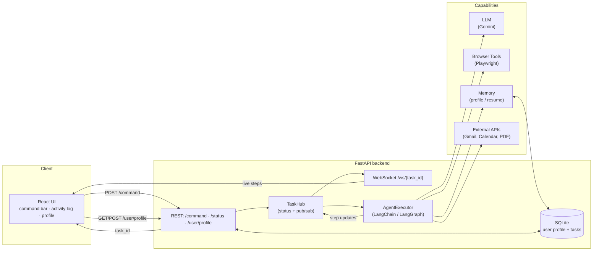

# AI Browser Agent — Architecture (1-page)

## Overview
A natural-language browser agent. The user types a command in a **React UI**; a
**FastAPI** backend turns it into a background **agent** task; the agent uses an
**LLM** to plan, drives a **browser** with Playwright tools, reads/writes a
**memory** store, and (later) calls **external APIs** (Gmail, Calendar). Progress
streams back to the UI live over a WebSocket.

## Diagram


### ASCII fallback
```
 React UI  ──POST /command──▶  FastAPI  ──▶  TaskHub  ──▶  AgentExecutor
    ▲                             │                          │  │  │
    │◀──live steps (WebSocket)────┴──◀── step updates ───────┘  │  │
    │                                                     ┌──────┼──┴──────┐
 GET/POST /user/profile ──▶ SQLite ◀── Memory            LLM  Browser  External
                                                       (Gemini)(Playwright)(Gmail…)
```

## Request lifecycle
1. **UI → `POST /command`** with `{ "command": "go to google.com and search AI news" }`.
2. Backend creates a `task_id`, registers the task in the **TaskHub**, and starts
   the agent as a **background task** — returning `task_id` immediately (non-blocking).
3. UI opens **`WS /ws/{task_id}`** and renders each step in the activity log as it arrives.
4. The **AgentExecutor** loops the **ReAct** pattern: reason (LLM) → act (browser
   tool) → observe → repeat, reading the **profile/memory** when it needs the
   user's name, email, or resume.
5. Each step is published to the TaskHub, fanned out to the WebSocket, and also
   readable via **`GET /status/{task_id}`** (for reconnects/polling).
6. On completion the task is marked `completed` with a result.

## Components
| Component | Tech | Responsibility |
|-----------|------|----------------|
| UI | React + Vite | command input, live activity log, profile settings |
| API | FastAPI | REST + WebSocket, CORS, validation |
| Contracts | Pydantic (`contracts.py`) | `UserProfile`, `Task`, `AgentAction` |
| Persistence | SQLite + SQLModel | user profile + task history |
| Agent | LangChain / LangGraph | plan + call tools + remember (thread memory) |
| Tools | Playwright | `navigate_to`, `click_element`, `type_text` |
| LLM | Gemini (free tier) | intent parsing + agent reasoning |
| External (Wk 7–10) | Gmail / Calendar / PDF | send email, schedule, parse resumes |

## Data contracts (`contracts.py`)
- **UserProfile** — name, email, phone, address, resume_text, resume_path.
- **AgentAction** — action, target_url, data, steps, needs_clarification, clarifying_question.
- **Task** — task_id, command, status (`pending|running|completed|failed`), steps, result, created_at.

## Failure modes handled / planned
Element-not-found & timeouts (per-tool try/except), cookie banners & popups
(detect+dismiss), session expiry (re-auth), LLM 503 overload (retry/backoff),
and long pages exceeding context (map-reduce summarization).
