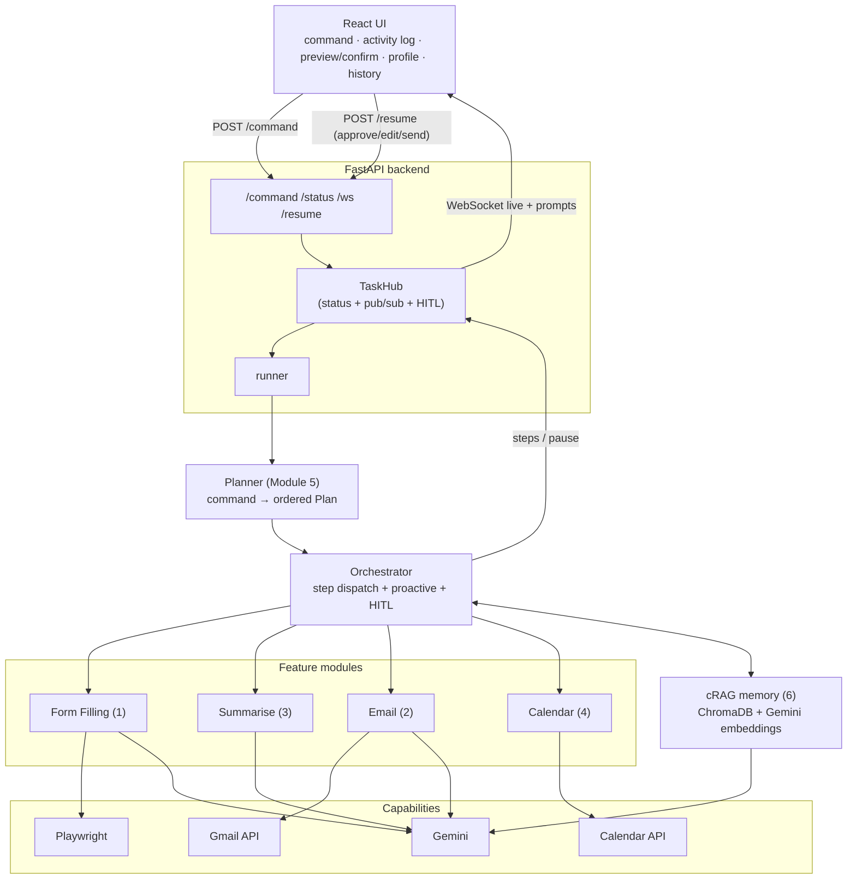

# Architecture — Agentic AI Browser Assistant

## System diagram


## Corrective-RAG loop (the brain, Module 6)
```
retrieve (ChromaDB) → grade (Gemini: correct/incorrect, fused with generate)
  → correct  → use the value
  → incorrect→ CORRECTIVE: ask the user once (HITL)  ── learn() ──▶ write back to ChromaDB
```
Used by form filling (missing field → ask), email drafting (contacts/context), and profile Q&A.

## Request lifecycle
1. UI `POST /command` → `task_id`, agent runs in background.
2. `runner` → `planner` decomposes the command into a `Plan` of module steps.
3. `orchestrator` runs each step, streaming to the `TaskHub` → WebSocket.
4. HITL steps (form **preview**, email **confirm**, proactive prompts) pause via
   `hub.wait_for_resume`; the UI renders a panel and `POST /command/{id}/resume`.
5. A step can request a **proactive** follow-up (form finds a deadline → offer calendar).
6. On completion the task is recorded in `TaskHistory`.

## Human-in-the-loop
LangGraph-style pausing implemented on the TaskHub: a task enters `needs_input`
with a `prompt` (`preview` / `confirm_send` / `confirm`), the UI shows the panel,
and `/resume` unblocks the awaiting coroutine with the user's decision.

## Data contracts (`app/core/schemas.py`)
`UserProfile`, `Task/TaskStatus`, `AgentAction`, `FormField`, `FieldPreview`,
`EmailDraft`, `Summary`, `JDAnalysis`, `CalendarEvent`, `PlanStep`, `Plan`,
`MemoryRecord`. SQLModel tables: `Profile`, `Contact`, `Group`, `TaskHistory`, `OAuthToken`.

## Reuse from Weeks 1–6
Playwright session + tools (A4), react-select/datepicker fill logic (A2),
TaskHub/WebSocket/SQLite/lifespan (A5), Pydantic contracts + React shell (A6),
parse_intent → the Module 5 planner (A3).
